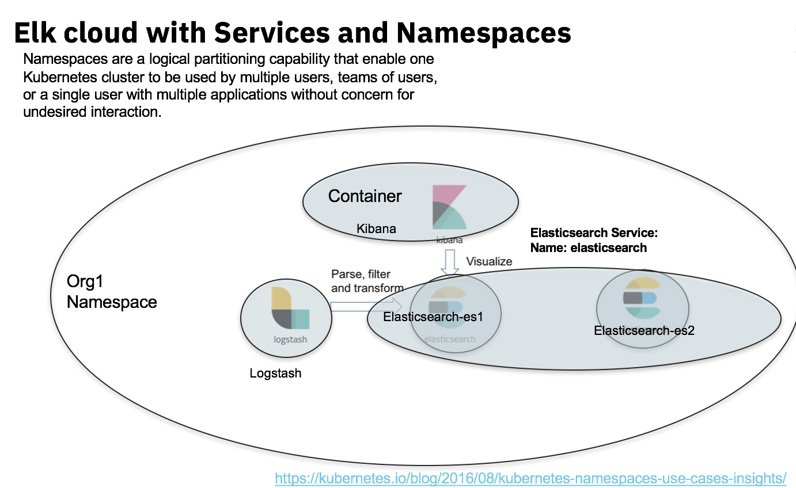

# Kube-Elk


Issues: 
After creating PVC -> ES is not able to use the PVC because of permissions- we need to
```
mkdir /usr/share/nfs/data /usr/share/nfs/logs /usr/share/nfs/backup
chmod -R 755 /usr/share/nfs
chown -R elasticsearch /usr/share/nfs
```


API to deploy an Elasticsearch, Logstash, and Kibana (ELK) stack on Kubernetes. 

Just requires a kube-config file to provision. 

Separates stacks via a namespace.



